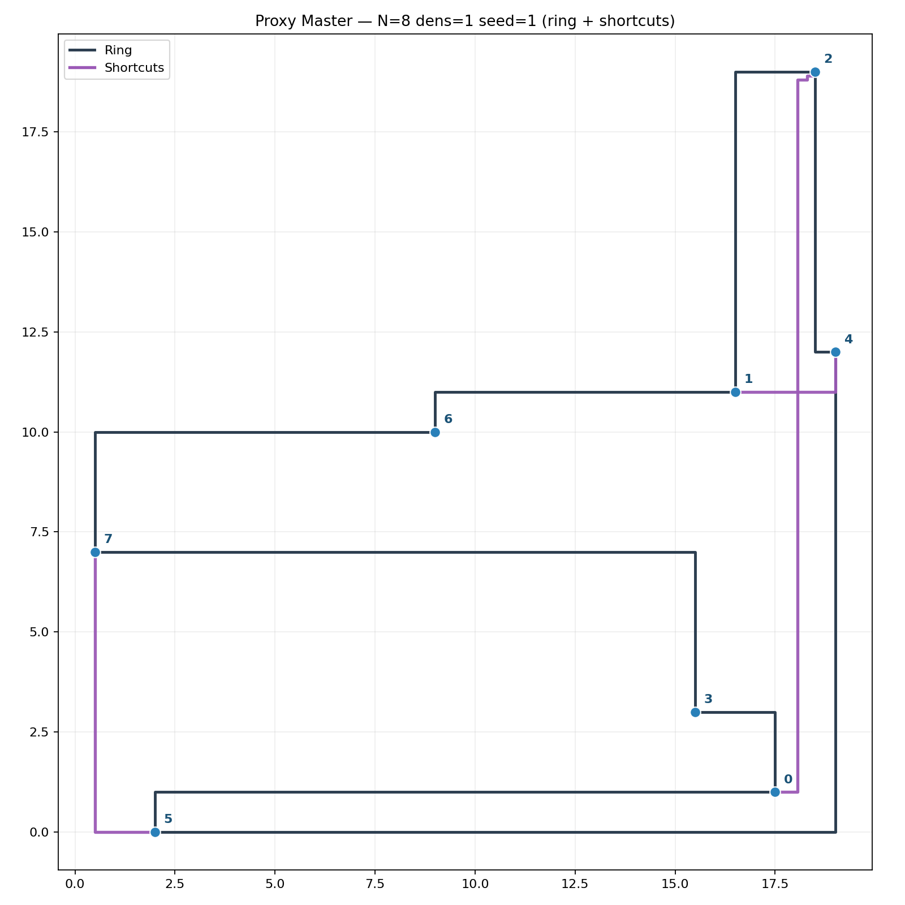

# EDA for Wavelength-Routed Optical NoCs

Research on **design automation** for wavelength-routed optical networks-on-chip (WR-ONoCs): how to place rings and shortcuts so the network needs less laser power.

The overall goal is to **minimize the optical power** that has to be launched into the chip. In practice that means designing for better signal quality and lower loss — especially **SNR**, **through loss**, and **propagation loss** along the waveguides. I work on this as a research assistant at the **Chair of Electronic Design Automation (EDA), TUM**, building on the **XRing** synthesis method by my supervisor and co-authors (DATE 2023).

Right now the focus is a **proxy-master** search that proposes ring + shortcut layouts, checks them against real geometry, and compares the resulting path metrics to a baseline. Formulations and flow charts from this stage:

- [`docs/pdf/master_milp.pdf`](docs/pdf/master_milp.pdf)
- [`docs/pdf/shortcut_solver_milp.pdf`](docs/pdf/shortcut_solver_milp.pdf)
- [`docs/pdf/flow_diagrams.pdf`](docs/pdf/flow_diagrams.pdf)

## Starting point — XRing

> T. Huang, Z. Li, et al., *XRing: A Crosstalk-Aware Synthesis Method for Wavelength-Routed Optical Ring Routers*, DATE 2023.  
> DOI: [10.23919/DATE56975.2023.10137181](https://doi.org/10.23919/date56975.2023.10137181)

XRing synthesizes optical ring routers (node placement on rings, shortcuts, power network). My SHK work extends that line: joint search and evaluation with an eye on the power / loss picture above.

## Current status

Shared-mode proxy vs baseline (excerpt; negative Δ / % = shorter worst-case path than baseline):

| N | Proxy mean W* | Baseline mean W | Mean Δ | Mean relative Δ |
|---|--------------:|----------------:|-------:|----------------:|
| 6 | 20.83 | 21.03 | −0.20 | −1.0 % |
| 8 | 24.38 | 25.05 | −0.67 | −2.7 % |
| 12 | 26.40 | 28.33 | −1.93 | −6.8 % |
| 14 | 26.19 | 27.11 | −0.92 | −3.4 % |
| 16 | 27.99 | 30.26 | −2.27 | −7.5 % |

## Layout

| Path | Contents |
|------|----------|
| [`src/`](src/) | C++ sources for the current search / evaluation pipeline |
| [`docs/pdf/`](docs/pdf/) | MILP notes and flow diagrams |
| [`figures/`](figures/) | Example layout |

## Role

**Student research assistant (SHK)** at the **Chair of Electronic Design Automation (EDA), Technical University of Munich**. I work on design automation for WR-ONoCs under supervision in this group — building skills in MILP / optimization (Gurobi), C++ tools that generate and evaluate optical on-chip interconnect layouts, and assessing designs with power-relevant metrics (SNR, through loss, propagation loss). This repository is a public snapshot of that ongoing work; it builds on XRing by my supervisor and co-authors.
